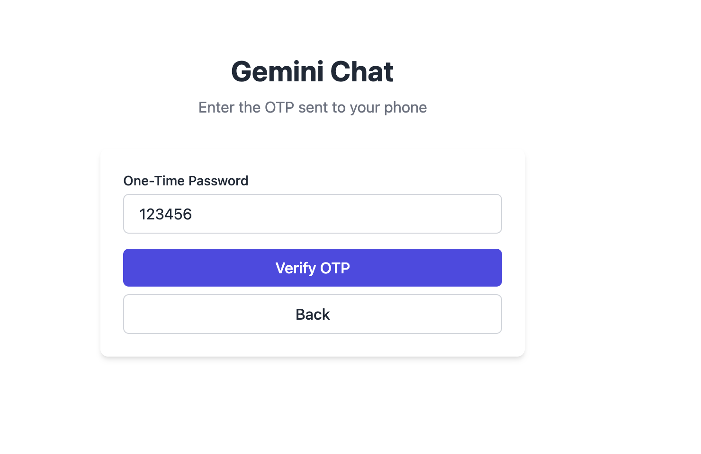
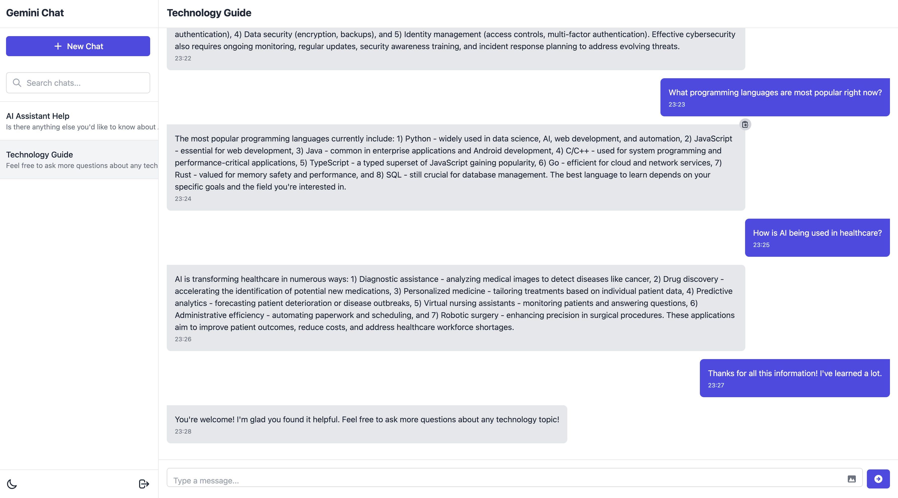
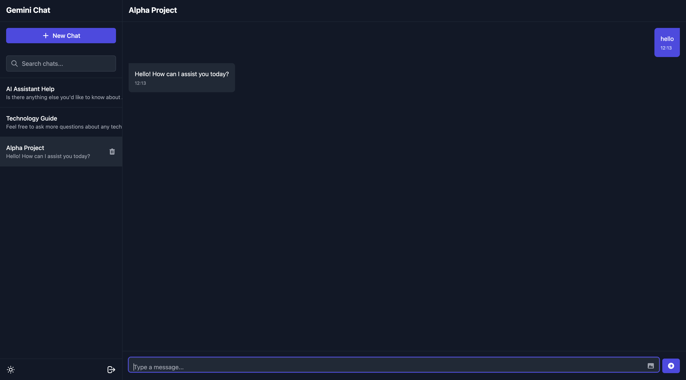

# Gemini-style Conversational AI Chat Application

A Next.js application that is a fully functional, responsive, and visually appealing frontend for a conversational AI chat application, inspired by the Gemini style. 
It simulates key features like OTP-based user authentication, dynamic chatroom management, AI-powered messaging, and image sharing, all built with modern web technologies.

## Project Overview

This project is a chat application that mimics the functionality of Google's Gemini AI. It allows users to:
- Send and receive messages in a chat interface
- Share and preview images
- Navigate between different chat threads
- Experience a responsive design that works on both desktop and mobile devices

[Live Demo Link] - https://ai-chat-app-lovat-five.vercel.app/login

## Setup and Run Instructions

### Prerequisites
- Node.js (v15.3.5)
- npm or yarn

### Installation

1. Clone the repository:
```bash
git clone [https://github.com/ayasa-choudhary/ai_chat_app]
cd ai_chat_app
```

2. Install dependencies:
```bash
npm install
# or
yarn install
```

3. Run the development server:
```bash
npm run dev
# or
yarn dev
```

4. Open [http://localhost:3000](http://localhost:3000) in your browser to see the application.

### Build for Production

```bash
npm run build
npm start
# or
yarn build
yarn start
```

## Folder/Component Structure

The project follows a modular structure:

```
ai_chat_app/
├── components/           # Reusable UI components
│   ├── chat/            # Chat-related components
│   │   ├── ChatInterface.tsx    # Main chat container
│   │   ├── MessageInput.tsx     # Message input with form validation
│   │   ├── MessageItem.tsx      # Individual message display
│   │   └── ImagePreviewModal.tsx # Image preview functionality
│   └── layout/          # Layout components
├── pages/               # Next.js pages/routes
│   ├── _app.tsx         # Custom App component
│   ├── index.tsx        # Home page
│   ├── login.tsx        # Login page
│   └── dashboard.tsx    # Dashboard with chat interface
├── store/               # Redux store configuration
│   ├── index.ts         # Store setup
│   └── slices/          # Redux slices
│       ├── authSlice.ts  # Authentication state
│       ├── chatSlice.ts  # Chat-related state
│       └── uiSlice.ts    # UI-related state
├── styles/              # Global styles and Tailwind CSS
└── public/              # Static assets
```

### Key Components

- **ChatInterface**: The main container for the chat functionality, handling message display, pagination, and infinite scroll.
- **MessageInput**: Handles message composition, form validation, and image uploads.
- **MessageItem**: Displays individual messages with support for text and images.

### Login Components

- **Login Page**: Implements a two-step authentication process with phone number input and OTP verification:
  - Phone number validation with country code selection
  - OTP verification with form validation
  - Responsive design for both mobile and desktop
  - Integration with Redux for state management

- **Authentication State Management**: Handles user authentication state using Redux:
  - OTP request and verification actions
  - User session persistence using localStorage
  - Secure logout functionality
  - State management for authentication flow

## Implementation Details

### Throttling

Throttling is implemented in the chat interface to prevent excessive API calls and provide a more realistic chat experience:

- In `ChatInterface.tsx`, AI responses are throttled using setTimeout with random delays (1-3 seconds) to simulate thinking time.
- This creates a more natural conversation flow and prevents overwhelming the UI with instant responses.

```typescript
// Simulate AI response after a delay
const delay = Math.floor(Math.random() * 2000) + 1000; // Random delay between 1-3 seconds

setTimeout(() => {
  // Generate AI response
  dispatch(setTypingStatus(false));
  dispatch(receiveMessage({ content: response }));
}, delay);
```

### Pagination

Message pagination is implemented to efficiently handle large chat histories:

- In `ChatInterface.tsx`, messages are paginated using a slice approach:
```typescript
const messagesPerPage = 20;
const [page, setPage] = useState(1);
const paginatedMessages = allMessages.slice(-page * messagesPerPage);
```

- A "Load older messages" button appears when there are more messages available:
```typescript
{allMessages.length > paginatedMessages.length && (
  <div className="flex justify-center mb-4">
    <button
      className="btn btn-outline text-sm py-1"
      onClick={handleLoadMore}
    >
      Load older messages
    </button>
  </div>
)}
```

### Infinite Scroll

The chat interface implements a form of infinite scroll for viewing messages:

- New messages automatically scroll into view using the `scrollToBottom` function.
- A ref (`messagesEndRef`) is used to identify the bottom of the message container.
- The view automatically scrolls when new messages are added or when the AI is typing.

```typescript
// Scroll to bottom when messages change or when typing status changes
useEffect(() => {
  if (isMounted) {
    scrollToBottom();
  }
}, [paginatedMessages.length, isTyping, isMounted]);

// Function to scroll to the bottom of the messages
const scrollToBottom = () => {
  if (isMounted) {
    messagesEndRef.current?.scrollIntoView({ behavior: 'smooth' });
  }
};
```

### Form Validation

Form validation is implemented using React Hook Form and Zod:

- In `MessageInput.tsx`, Zod schema validation ensures messages are not empty:
```typescript
const messageSchema = z.object({
  content: z.string().min(1, 'Message cannot be empty'),
});
```

- React Hook Form is used to manage form state and validation:
```typescript
const {
  register,
  handleSubmit,
  reset,
  formState: { errors },
} = useForm<MessageFormValues>({
  resolver: zodResolver(messageSchema),
});
```

- Validation errors are displayed to the user:
```typescript
{errors.content && (
  <p className="absolute -top-6 left-0 text-sm text-red-600">
    {errors.content.message}
  </p>
)}
```

- Additional validation is implemented for image uploads, checking file type and size:
```typescript
// Check file type
if (!file.type.startsWith('image/')) {
  alert('Please upload an image file');
  return;
}

// Check file size (max 5MB)
if (file.size > 5 * 1024 * 1024) {
  alert('Image size should be less than 5MB');
  return;
}
```

## Screenshots







